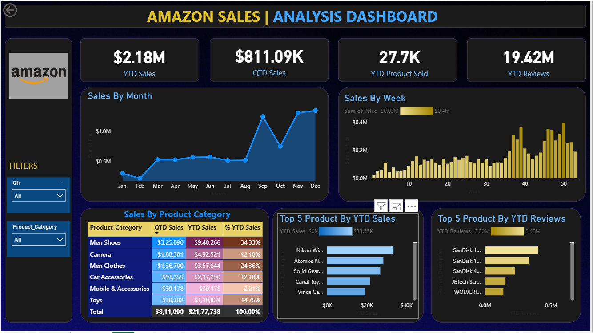

# 📊 Amazon Sales Analysis Dashboard

## 📌 Overview
This project presents an interactive **Amazon Sales Dashboard** built using Power BI. It provides insights into sales performance, product trends, and customer behavior.

---

## 🖼️ Dashboard Preview

---

## 🚀 Features
- 📈 YTD & QTD Sales Analysis  
- 📦 Product Sold Tracking  
- ⭐ Customer Reviews Insights  
- 📅 Monthly & Weekly Trends  
- 🛒 Category-wise Sales Distribution  
- 🏆 Top 5 Products Analysis  
- 🎛️ Interactive Filters  

---

## 📊 Key Metrics
- **YTD Sales:** $2.18M  
- **QTD Sales:** $811.09K  
- **Products Sold:** 27.7K  
- **Total Reviews:** 19.42M  

---

## 🛠️ Tools & Technologies
- Power BI  
- Power Query  
- DAX  
- Data Visualization  

---

---

## 🔗 Important Links

### 📊 Live Dashboard Preview
[Click Here](https://drive.google.com/file/d/1E-_tI18L7eHe0ZToM35GpkQmPAB8lEBQ/view?usp=sharing)

### 📁 Dataset
[Download Dataset](https://docs.google.com/spreadsheets/d/1D60MBY1VTSCQwo6RCpZU95mLj9LmzUDI/edit?usp=sharing&ouid=102207403380858406011&rtpof=true&sd=true)

### 📦 PBIX File
[Download PBIX](https://drive.google.com/file/d/1E-_tI18L7eHe0ZToM35GpkQmPAB8lEBQ/view?usp=sharing)

---

## 📈 Insights
- Men Shoes category contributes the highest sales (~34%)  
- Sales increase significantly in the last quarter  
- Weekly sales peak near year end  
- High reviews ≠ always high sales  

---

## ⚙️ How to Use
1. Download the `.pbix` file  
2. Open in Power BI Desktop  
3. Refresh dataset  
4. Explore dashboard using filters  

---

